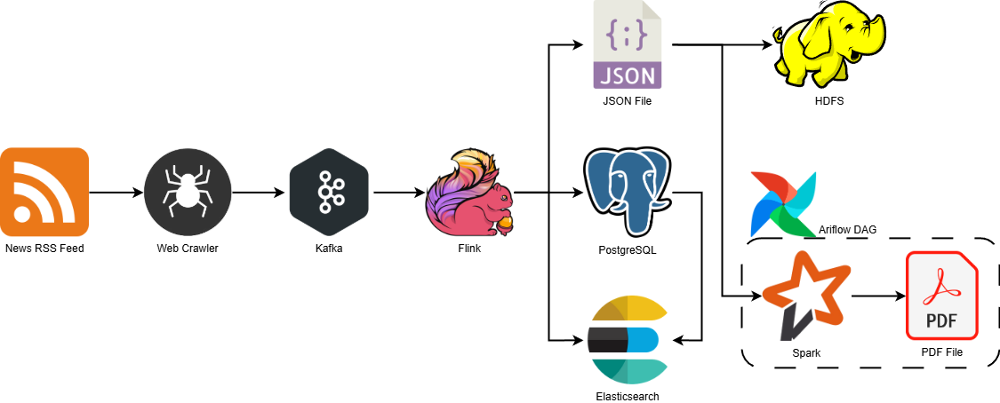
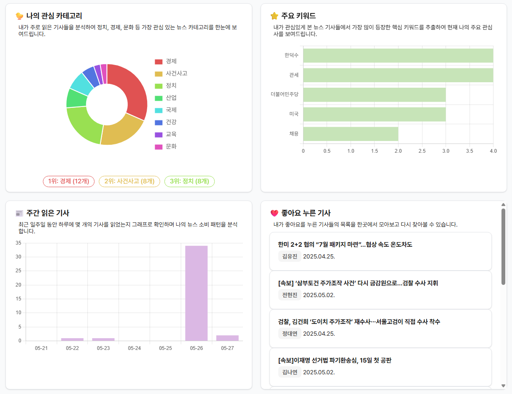

# 📰 나만의 뉴스 기사 'EVERY NEWS'

## 참고 자료

- [API 명세서](https://documenter.getpostman.com/view/42053354/2sB2qdffLZ)
- [프로젝트 보고서 보기 (PDF)](./result/report.pdf)

## 프로젝트 소개

- 뉴스 데이터를 실시간 수집 및 분석하여 사용자에게 맞춤형 뉴스를 제공할 수 있는 AI 기반 뉴스 플랫폼입니다.
- 자신에게 맞는 기사를 추천받고 하이라이트 기능을 통해 중요한 내용을 정리하며, 개인화된 뉴스 경험을 제공합니다.

## 1. 역할 분담

### 🐔 유건우 (back-end)

- **기능**
  - 사용자 추천 기사, 좋아요, 댓글 기능 구현, 데이터 파이프라인 설계

### 🐤 권지현 (front-end)

- **기능**
  - 하이라이트, 대시보드 페이지, 챗봇, Elasticsearch 검색 기능 구현

## 2. 개발 기간 및 작업 관리

### 개발 기간

- 전체 개발 기간 : 2025.04.11 ~ 2025.05.27

### 작업 관리

- 페어별 코드 리뷰를 통해 진행 상황을 공유하고, 앞으로의 방향성에 대해 함께 고민했습니다.

## 3. 개발 환경

### Backend

- **Django**: REST API 서버 구현
- **PostgreSQL**: 메인 데이터베이스
- **Elasticsearch**: 뉴스 검색 엔진
- **Redis**: 세션 및 캐시 관리
- **Apache Airflow**: 데이터 파이프라인 자동화
- **Apache Kafka**: 실시간 데이터 스트리밍
- **Apache Spark**: 대용량 데이터 처리
- **Ollama**: 로컬 LLM 기반 챗봇

### Frontend

- **Vue.js 3**: SPA 프론트엔드 구현
- **Vite**: 빌드 도구
- **Axios**: HTTP 클라이언트

### AI/ML

- **OpenAI API**: 텍스트 분석 및 임베딩
- **pgvector**: 벡터 유사도 검색
- **LangChain**: LLM 통합

## 4. 프로젝트 구조

📦 data-pjt
├── 📂 front-pjt/                 # Vue.js 프론트엔드 프로젝트<br>
│   ├── 📂 public/               # 정적 파일<br>
│   ├── 📂 src/                  # 소스 코드<br>
│   │   ├── 📂 assets/          # 이미지, 스타일 등<br>
│   │   ├── 📂 components/      # Vue 컴포넌트<br>
│   │   ├── 📂 views/           # 페이지 뷰<br>
│   │   ├── 📂 common/          # 버튼, 입력창, 모달 등 공통 UI<br>
컴포넌트<br>
│   │   ├── 📂 store/           # 상태 관리<br>
│   │   ├── 📂 utils/           # 유틸리티 함수<br>
│   │   └── App.vue/             <br>
│   ├── package.json<br>
│   └── vite.config.js<br>
│<br>
├── 📂 django_project/           # Django 백엔드 프로젝트<br>
│   ├── 📂 news/                # 뉴스 앱<br>
│   │   ├── 📂 migrations/      # DB 마이그레이션<br>
│   │   ├── 📂 management/      # 커스텀 명령어<br>
│   │   ├── [models.py]        # 데이터 모델<br>
│   │   ├── [views.py]          # 뷰 로직<br>
│   │   ├── [urls.py]          # URL 라우팅<br>
│   │   └── [serializers.py]    # API 직렬화<br>
│   ├── 📂 django_project/      # 프로젝트 설정<br>
│   │   ├── [settings.py]       # 프로젝트 설정<br>
│   │   ├── [urls.py]           # 메인 URL 설정<br>
│   │   └── [wsgi.py]           # WSGI 설정<br>
│   └── [manage.py]            # Django 관리 스크립트<br>
│<br>
├── 📂 batch/                    # 배치 처리 관련<br>
│   ├── 📂 dags/                # Airflow DAGs<br>
│   │   ├── 📂 scripts/         # 배치 스크립트<br>
│   │   └── daily_report.py     # 일일 리포트 생성<br>
│   └── docker-compose.yaml     # Airflow 설정<br>
│<br>
├── 📂 data/                     # 데이터 저장소<br>
│   ├── 📂 realtime/           # 실시간 데이터<br>
│   └── 📂 news_archive/       # 아카이브 데이터<br>
│<br>
├── 📜 news_crawling.py         # 뉴스 크롤링 스크립트<br>
├── 📜 news_producer.py         # Kafka 프로듀서<br>
├── 📜 news_consumer.py         # Kafka 컨슈머<br>
├── 📜 openai_api.py           # OpenAI API 연동<br>
├── 📜 requirements.txt         # Python 의존성<br>
└── 📜 [README.md]              # 프로젝트 문서<br>


## 5. 실행 순서

```python
# 가상환경 실행
python ~/venvs/data-pjt/bin/activate

# Zookeeper 실행
cd /usr/local/kafka
bin/zookeeper-server-start.sh config/zookeeper.properties

# Kafka Broker 실행
cd /usr/local/kafka
bin/kafka-server-start.sh config/server.properties

# hdfs 실행
start-dfs.sh
start-yarn.sh

# Docker 실행
cd batch
docker compose up -d

# Django 실행
cd django_project
python manage.py migrate
python manage.py news_index
python manage.py runserver

# 만약 elasticsearch에 저장해야 할 데이터가 있다면
python manage.py migrate_news

# Vue.js 실행
cd front-pjt
npm init
npm run dev
```

```python
# consumer 실행
python news_consumer.py

# producer 실행
python news_producer.py
```

```bash
# 루트 폴더에 .env 파일 생성
nano .env

# 아래 내용 생성한 파일에 추가
DB_USERNAME=<YOUR_DB_USERNAME>
DB_PASSWORD=<YOUR_DB_PASSWORD>
OPENAI_API_KEY=<YOUR_API_KEY>
KAFKA_CONNECTOR_PATH=/path/to/flink-sql-connector-kafka-3.3.0-1.20.jar
```

## 6. 데이터 파이프라인



## 7. 페이지별 기능

---

### 📄 메인 페이지 : `NewsView`

- 수집한 모든 기사를 확인할 수 있는 서비스 메인 페이지
- 사용자 이름, 추천 기사 제공으로 개인화된 경험 제공
- 기사 정보(제목, 카테고리, 기자명, 날짜, 요약 등)를 카드 형식으로 확인 가능
- 좋아요 수, 조회 수, 댓글 수 확인 및 기사 출처 페이지 링크 제공


**주요 기능**

1. **카테고리 필터링**
    - 상단 탭으로 17개 카테고리 필터링
    - OpenAI를 활용한 기사 자동 분류
2. **정렬 방식 선택**
    - 최신순 / 추천순 정렬 선택
    - 추천순 : 좋아요, 조회수 기반, 코사인 유사도 기반으로 좋아요에 좀 더 가중치를 적용
3. **검색 기능**
    - Elasticsearch 기반 검색 기능 구현
    - (향후) 자동완성, 실시간 검색어, 추천 검색어 추가 예정

---

### 📰 뉴스 상세 보기 페이지 : `NewsDetailView`

- 상세 페이지를 통해 기사 본문 내용 확인
- 해당 기사와 관련된 기사 목록 제공, 챗봇 제공


**주요 기능**

1. **하이라이트 기능**
    - 텍스트 선택 시 하이라이트가 생성되며, 하이라이트 삭제도 가능
    - 하이라이트 기능을 통해 관심있게 본 내용이 무엇인지 한 눈에 확인이 가능함
2. **연관 기사**
    - 코사인 유사도를 기반으로 유사한 기사들 표시
3. **댓글**
    - 댓글 작성 기능 제공
    - 개선할 점 : 댓글의 수정 및 삭제
4. **챗봇**
    - Ollama 기반 멀티턴 방식의 뉴스 챗봇
    - 해당 기사 본문을 기반으로 대화형 요약 제공
    - 대화 초기화 버튼 제공
    - 페이지를 나갔다가(뒤로가기) 다시 들어올 시 챗봇 내용 초기화

---

### 📊 대시보드 : `DashBoardView`

- 유저의 데이터를 기반으로 개인화된 맞춤형 대시보드를 제공
- 읽은 기사의 목록과 수, 관심 카테고리와 주요 키워드 등 분석 결과들을 제공




**주요 기능**

1. **사용자 프로필**
    - 이름과 주요 활동(댓글, 좋아요, 하이라이트, 출석) 제공
2. **목표달성바**
    - 월 기사 양 표시 및 전월 대비 변화 시각화
    - 목표 달성률 (100개 기준) 표시
3. **기사 캘린더**
    - 월별 기사 읽은 날짜 시각화 및 기사 수 표시
    - 날짜 클릭 시 해당 날짜의 기사 목록 제공
4. **주요 통계**
    - 도넛 차트로 카테고리별 비율 시각화
    - 상위 3개 카테고리, 상위 5개 키워드 표시
    - 최근 7일간 일별 읽은 기사 수, 좋아요 기사 목록 제공

---

### 🔐 로그인 : `LoginView`

- 상태관리를 통해 로그인 / 로그아웃 전환
- Token 기반 인증 방식으로 사용자 정보 관리


---

### 📝 회원가입 : `RegisterView`

- dj-rest-auth 패키지를 활용하여 회원가입 기능 구현
- 유효성 검사를 통해 에러 메시지 출력


---

## 8. 개선 목표

---

- **댓글 기능**
    - 댓글 삭제 및 수정 기능 추가
    - 대댓글 기능 추가
- **검색 기능**
    - 추천 검색어
    - 실시간 검색어
    - 자동완성 기능
- **회원정보**
    - 본인이 남긴 하이라이트, 좋아요, 댓글 목록 제공

---

